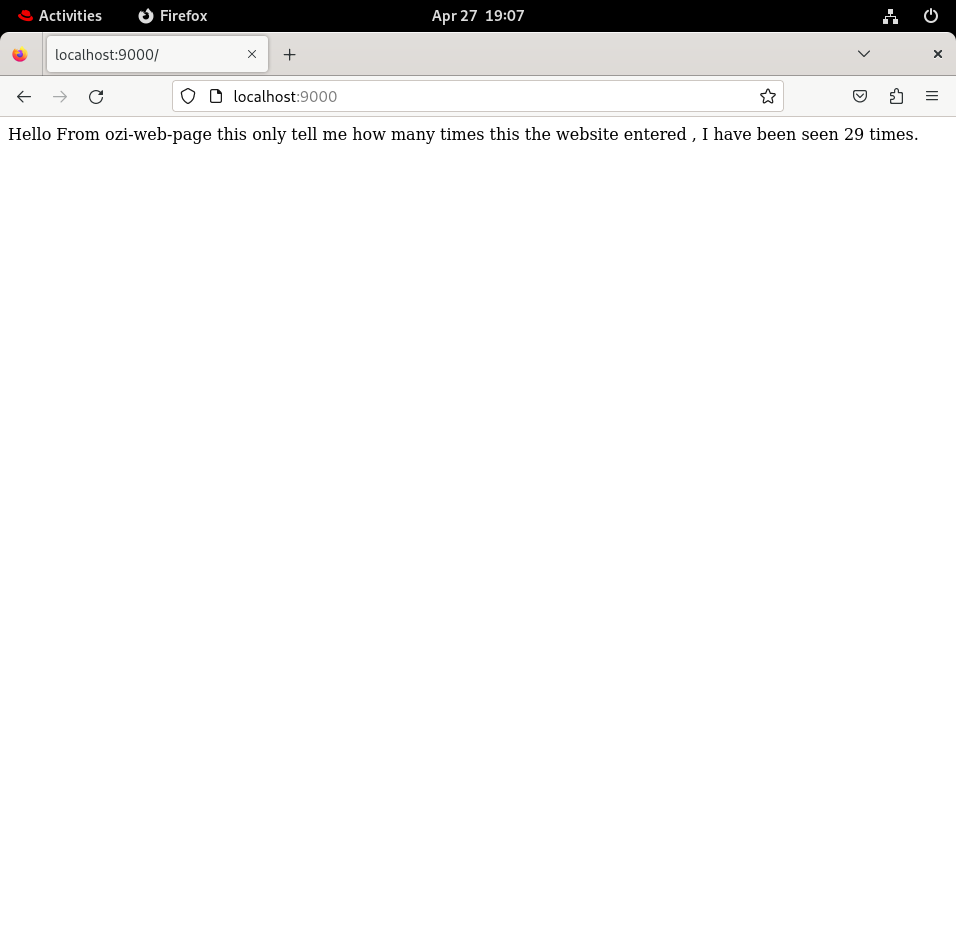

# -flask-redis-docker-compose
# 🐳 Simple Flask & Redis Web App with Docker Compose

> **Project 3** | Docker & Containerization Learning Path

A lightweight web application built with **Python (Flask)** that tracks and displays page visits using **Redis** as an in-memory database. The entire stack is containerized and orchestrated using **Docker Compose**.

## 📖 Overview
When you visit the application, it increments a counter stored in Redis and returns a message showing how many times the page has been accessed. This project demonstrates:
- Multi-container orchestration with Docker Compose
- Service-to-service networking in Docker
- Persistent state using Redis
- Development-friendly configuration (hot-reloading & debug mode)

---
## 🛠 Tech Stack
| Component      | Technology           |
|----------------|----------------------|
| Backend        | Python 3.7 + Flask   |
| Database       | Redis (In-memory)    |
| Containerization | Docker & Docker Compose |
| Base OS        | Alpine Linux         |
---
## 📦 Features
✅ Real-time visit counter persisted in Redis  
✅ Automatic connection retry logic during startup  
✅ Hot-reloading enabled via volume mounting & `FLASK_DEBUG=true`  
✅ Fully reproducible environment with a single command  
---
## 🚀 Getting Started
### Prerequisites
- [Docker](https://docs.docker.com/get-docker/) & [Docker Compose](https://docs.docker.com/compose/install/) installed
- Port `9000` available on your host machine
---
### Installation & Run
1. **Clone the repository**
   ```bash
   git clone https://github.com/eng-Ahmed-Kamel/-flask-redis-docker-compose.git
   
   cd 3rd-project
   ```

2. **Build & start the containers**
   ```bash
	docker compose up -d
	```
3. **Access the application**
   ```bash
	curl http://localhost:9000
	```
   # or open http://localhost:9000 in your browser
4. **Stop & clean up**
```bash
docker compose down
```
---
#📂 Project Structure
3rd-project/
├── app.py                 # Flask application & Redis counter logic
|── Dockerfile             # Image build instructions for the Flask service
├── docker-compose.yaml    # Multi-container orchestration config
├── requirements.txt       # Python dependencies (flask, redis)
├── README.md              # Project documentation
|── git.sh                 # (Optional) Git workflow automation script
---
#⚙️ How It Works
1.The web service runs a Flask app that connects to the redis service via Docker's internal DNS (host='redis').
2.Each request to / triggers cache.incr('hits'), which atomically increments the counter in Redis.
3.A retry mechanism (up to 5 attempts with 0.5s delays) prevents crashes if Redis hasn't fully started yet.
4.docker-compose.yaml maps host port 9000 → container port 5000 and mounts the local directory for live code updates during development.

---

#🛠 Development Notes:
- Live Reload: Changes to app.py reflect instantly thanks to .:/app volume mounting and FLASK_DEBUG=true.
- Port Mapping: The app is exposed on http://localhost:9000. Change the port in docker-compose.yaml if 9000 is occupied.
- Production Ready?: For production, remove the volume mount, set FLASK_DEBUG=false, and consider using a WSGI server like gunicorn or uwsgi

----
📜 Commands Cheat Sheet
Command >>> Description
docker compose up -d >>> Build & start containers in background
docker compose down >>> Stop & remove containers
docker compose logs -f >>> Stream container logs in real-time
docker compose ps >>> Check running services status
docker compose build >>> Rebuild images (e.g., after Dockerfile changes)
